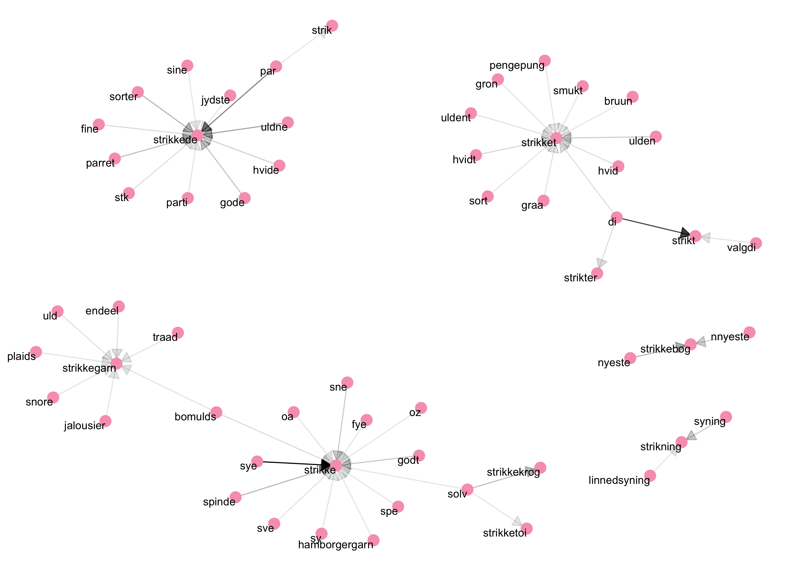

# Links i undervisningen

# Strik og Kod

Dette repositorie indeholder materialet fra workshoppen Strik og Kod fra AU Library, Det Kgl. Bibliotek.  

Workshoppen handler om at trække paralellerne mellem strikning og kodning. "Kodning" forståes i denne sammenhæng som kodebaseret databehandling og lægger sig derfor inden for feltet data science. Som følge af workshoppens afsæt på Arts vil det nærmere blive et text mining eksempel. I text mining er man interesseret i at udtrække informationer af store mængder tekst - hvilket netop interesserer de fleste humanister.

Ingen kageopskrift uden et billede af kagen som noget af det første. Det samme gør sig gældende her. Det endelige resultat af S_K.Rmd(S_K_arbejdsbog.Rmd bruges live til workshops) er visualiseringen herunder, der viser hvilke ord, der bruges før forskellige ord om strikning. I grafen kan vi se at der går en pil fra "bomulds" og peger mod "strikkegarn", hvilket betyder, at det har optrådt som "bomulds garn". Jo mere markant pilen er jo flere forekomster har der været. Således kan vi altså se at et meget hyppigt forekommende ordpar er "di strikt", hvilken tydeligvis er en fejllæsning af ordet "distrikt". Dette handler om at vores data er maskingenkendt, hvilket ikke altid går lige godt.  

Er du interesseret? Så download S_K.Rmd og kør den chunk for chunk i din desktop R-studio. Alternativt kan du oprette dig hos [Rstudio Cloud](https://rstudio.cloud) og oprette et nyt projekt med linket til dette github repositorie.  

# Nyttige links efter workshoppen
* [Tidy Text Mining with R](https://www.tidytextmining.com)-bogen.
* [Danish Newspaper API](http://labs.statsbiblioteket.dk/labsapi/api//api-docs?url=/labsapi/api/openapi.yaml)
(Karoline fylder flere links på her) 

