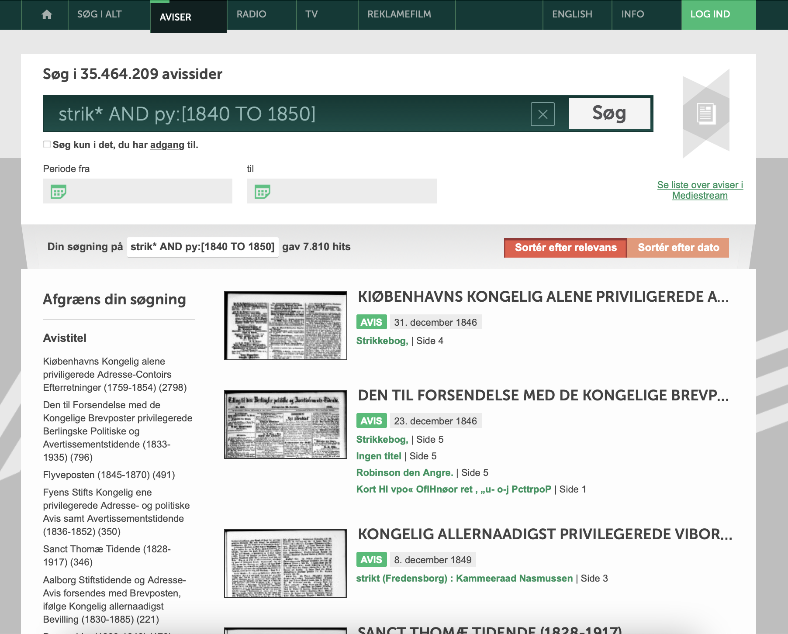
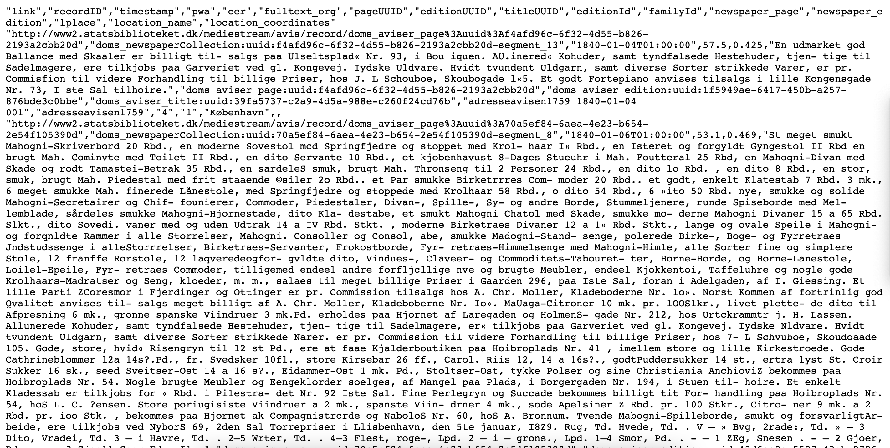
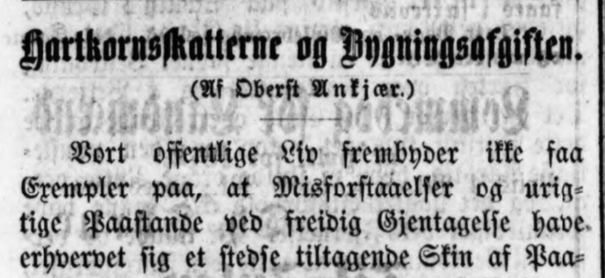

```{=html}
<style>
    body { background-color: #f7a1bd; }
    p {color:white;}
    h1,h2,h3,h4,h5,h6 {color:white;}
</style>
```
Dette dokument udgør kodedelen af workshoppen Strik og Kod fra AU Library, Det Kgl. Bibliotek. Workshoppen handler om at trække paralellerne mellem strikning og kodning. "Kodning" forståes i denne sammenhæng som kodebaseret databehandling og lægger sig derfor inden for feltet data science. Som følge af workshoppens afsæt på Arts vil det nærmere blive et text mining eksempel. I text mining er man interesseret i at udtrække informationer af store mængder tekst - hvilket netop interesserer de fleste humanister.

Ingen kageopskrift uden et billede af kagen som noget af det første. Det samme gør sig gældende her. Det endelige resultat for enden af dette dokument er visualiseringen herunder, der viser de hyppigste forekommende ord i artikler om strikning efter man har sorteret stopord fra (den, det, at, og, i - ord som ikke bærer mening)


Strikkeord og hvilke ord der ledsager dem

<br>

# Indlæsning af R-pakker

Vi arbejder i statistik-programmet R, der giver mange muligheder for statistisk arbejde og efterfølgende grafisk fremstilling af resultaterne. I R arbejder man med pakker, som tilføjer forskellige funktionaliteter til grundstammen af R-funktioner. I dette tilfælde er de relevante pakker:

```{r, message=FALSE}
library(tidyverse)
library(tidytext)
library(ggwordcloud)
library(wordcloud)
```

# Data - artikler om strikning

Det første vi har brug for er noget tekstdata. Her vil vi bruge data fra den danske avissamling. Data vil blive leveret af Det Kgl. Biblioteks eksperimentielle Newspaper-API. Interaktion med API'en bygger på søgninger i Mediestream, der er Det Kgl. Biblioteks platform til søgning blandt andet i avissamlingen. Inden man kaster sig over API'en er det en kod idé at gøre sig bekendt med de udvidede søgekoder til Mediestream. Hertil kan man bruge Mediestream søgetips - <https://www2.statsbiblioteket.dk/mediestream/info/soegetips>

Se desuden konkrete søgekoder i spil her: <https://gist.github.com/maxodsbjerg/e2dd484d3c9dcaa9c422a861d6a93f6e>

Når man er tryg ved at afgrænse sine søgninger med søgekoder kan man bruge dette interface til at lave sine kald til Newspaper API'et: <http://labs.statsbiblioteket.dk/labsapi/api//api-docs?url=/labsapi/api/openapi.yaml> (Vælg "aviser/export/fields")

I denne workshop har vi forberedt et API-kald der laver følgende søgning og returnerer det matchede som data:

> strik\* AND py:[1845 TO 1850]

Denne søgning giver os altså artikler i avissamlingen i perioden 1845 til 1850, som indeholder ord der starter med "strik" og alle endelser. Derved får vi både "strikke", "strikning", "strikkede", "striktøj" og "strikketøj". Men vi får også ældre ord som "strikt" med.

I Mediestream ser søgningen således ud:  Men når vi får API til at returnere data for os, så får vi den til at returnere det i CSV-format(Comma Separated Values). Den måde API'en returnerer data er ved at give os et link. Dette link vil indeholde filen med vores data. I nogle vil linket åbne filen i browseren og det vil se nogenlunde sådan her ud:

 I andre tilfælde vil den downloade csv-filen ned på din computer. Det vigste er i midlertidig at API giver os et link med de rå data der passer til vores søgning. Ikke noget farvelade og interface vi kan pege og klikke på som i Mediestream-søgningen ovenfor. Det rå data kan puttes direkte ind i R, hvorefter man begynder at kunne lave sin databehandling. Lad os få vores artikler om strikning ind i R!

## Indlæs data

I kodeboksen herunder bruger vi functionen `read_csv` til at læse det link vi har fået fra API'en. Denne læsning gemmer vi i et element, som vi kalder "strik"(det kunne også være "strikke_artikler_1845_1850", men vi kommer til at referere til det mange gange fremefter, så det er fedt, at det er kort og præcist):


```{r}
strik <- read_csv("http://labs.statsbiblioteket.dk/labsapi/api/aviser/export/fields?query=strik%2A%20AND%20py%3A%5B1845%20TO%201850%5D&fields=link&fields=timestamp&fields=fulltext_org&fields=familyId&fields=lplace&max=-1&structure=header&structure=content&format=CSV")
```

Dette giver os en ny data frame i det panel der hedder "Environment" - Den hedder "strik" og vi kan se, at den har 7810 observation af 16 variable. Klik på "strik"-data framen og inspicer dit data!

Særlig interessant for os er kolonnen "fulltext_org" - det er her teksten fra artiklerne bor. Ved første øjekast skærer det dog i øjnene. Den er sprængfyldt med fejl og her er i stødt på en af faldgruberne ved at arbejde med gammel tekst: OCR-fejl.

For at forstå hvorfor disse fejl er opstået er det nødvendigt at vende blikket mod digitaliseringen. I denne proces affotograferer man aviserne (enten fra mikrofilm eller fra original), Herefter lader man en computeralgoritme løbe igennem avissiderne. Denne algoritme gør to ting: 1. Segmenterer artiklerne - med andre ord så gætter den hvilke rubrikker hører til hvilke overskrifter 2. Udfører tekstgenkendelse således, at teksten bliver digital og man kan søge i den. Dette kaldes også OCR (Optical Character Recognition)

Denne algoritme er udviklet til moderne aviser, og derfor er resultatet oftest ret godt, når man har med nyere aviser at gøre (1910 til nu). Går man længere tilbage i tiden, begynder kvaliteten på digitaliseringen at falde. Dette skyldes blandt andet, at opsætningen af aviser er en anelse forskellige fra moderne opsætning. Èn af de helt store problemer er, at tekstgenkendelsen er dårlig. Dette skyldes, at man i gamle aviser brugte frakturtyper til at trykke sine aviser. Denne tekst vil nogle kende som gotiske bogstaver eller krøllede bogstaver.  Håbet er dog imidlertidigt at vores data er så omfavnrigt, at vi alligevel kan få noget spændende ud af det.

# Indledende analyse - og lidt oprensning

En anden af kolonner er "lplace" som angiver hvor avisen er udgivet henne. Ved først at angive hvilken data frame som vi arbejder med. Dernæst bruger vi den såkaldte pipe, `%>%`, til at sende data videre til en funktion. Her bruger vi `count`, der skal have vide hvilken kolonne den skal tælle sammen. Vi angiver her at vi vil tælle på "lplace", der ved kan vi se hvordan vores materiale fordeler sig geografisk:

```{r}
strik %>% 
  count(lplace, sort = TRUE)
```

Ovenfor kan vi se optældningen og ikke overraskende er langt den største del af materialet fra København, der i perioden var klart den største by med flest aviser. Der dukker dog også andre interessante ting op. "Charlote Amalie" og "Christianssted" er byer på det daværende Dansk Vestindien hvorfor de altså er i avissamlingen. Disse er mestendels på engelsk og vil forstyrre i text miningen af de danske artikler om strikning. Derfor vil vi sortere dem fra, men inden vi kaster os over det, så ser vi også at Aarhus både benævnes som "Århus" og som "Aarhus". Disse to skal vi også have justeret således, at vi kun har en Aarhus i datasættet.

Lige som før starter vi med at nævne den data frame vi er interesseret i at arbejde med. Med pipen `%>%` fører vi det videre til `filter`, der filtrerer data på lplace kolonnen. Bid mærke i udråbstegnet(`!`) foran "lplace"!!!! Dette gør at den filtrere Christianssted og Charlotte Amalie fra. Uden udråbstegnet ville vi kun få tekst fra de to byer!

Dernæst piper(`%>%`) vi data videre (nu uden de to Danske Vestindiske byer) til en ny funktion. Det er en god idé at tænke på pipen som netop et rør, som man hælder data ned i, hvorefter det gribes af en funktion, der laver en ændring på data og resultatet af denne ændring kan så pipes videre igen. Den nye funktion er `mutate`, der laver ændringer på værdier i kolonner eller skaber nye kolonner. Her vil vi gerne ændre på kolonne "lplace" og den ændring får vi funktionen `str_replace` til at lave. Funktionen skal læses og siges som "string replace" og i den sammenhæng skal "string" forståes som en karakterstreng. Den finder altså en karakterstreng og erstatter den med en anden. I vores sammenhæng erstatter den "Århus" med "Aarhus".

Til sidst gemmer vi ændringer til vores dataframe "strik". Det sker til allersidst med `-> strik`. Hvis ikke man gør dette "falder" resultatet ud under kodeboksen, som vi så ovenfor, da vi talte "lplace".

```{r}
strik %>% 
  filter(!lplace %in% c("Christianssted", "Charlotte Amalie")) %>% 
  mutate(lplace = str_replace(lplace, "Århus", "Aarhus")) -> strik
```

Vi kan nu igen tælle lplace og se, at ændringerne er som vi vil have dem (bid mærke i at resultatet falder ud under boksen, da vi *ikke* har angivet `->`:

```{r}
strik %>% 
  count(lplace, sort = TRUE)
```

# Text mining opgaven

Data behandlingen vil tage udgangspunkt i [Tidy Data-princippet](https://cran.r-project.org/web/packages/tidyr/vignettes/tidy-data.html) som den er implementeret i tidytext-pakken. Tankegangen er her at tage en tekst og splitte den op i enkelte ord. På denne måde optræder der kun ét ord per række i datasættet.

Det næste der sker er, at vi omdanner data til det førnævnte tidytext format, hvor hvert ord kommer til at stå på en række for sig selv, hvilket gøres med `unnest_tokens`. Resultatet af denne transformation gemmer vi til den efterfølgende analyse i "strik_tidy".

```{r}
strik %>% 
  unnest_tokens(word, fulltext_org) -> strik_tidy
```

Lad os lige udprinte denne nye dataframe for at se tidytext-formatet i "praksis". Dette gøres ved at skrive data framens navn:

```{r}
strik_tidy
```

Ved at bladre i kolonner(den lille sorte pil i højre top) kan vi helt til sidst se kolonnen "word", der nu indeholder de enkelte ord.

# Analyse

## Wordcloud

For at danne os et overblik over vores datasæt vil vi nu lave en optælling af de mest brugte ord i artiklerne om strikning i perioden 1845 til 1850:

```{r}
strik_tidy %>% 
  count(word, sort = TRUE)
```

<br> Ikke overraskende er det småord der optræder hyppigst i datasættet. En måde at omgå disse er at indlæse en stopordliste, som man kan bruge til at fjerne stopordene:

```{r message=FALSE}
stopord <- read_csv("https://gist.githubusercontent.com/maxodsbjerg/4d1e3b1081ebba53a8d2c3aae2a1a070/raw/e1f63b4c81c15bb58a54a2f94673c97d75fe6a74/stopord_18.csv")
```

<br>

Vi prøver nu igen med funktionen anti_join(), der fjerne stopordene fra data:

```{r}
strik_tidy %>% 
  anti_join(stopord) %>% 
  count(word, sort = TRUE) 
```

<br> Allerede her har vi en del interessante ord. Men der er noget der tyder på, at der er en del sammenhæng mellem tjenestepiger, der søger "condition", som i gammeldags sprogbrug er "tjenende stilling" eller en plads. Vi ser også OCR-fejlen "eondition" og den anden stavemåde "kondition".

Men listen er lidt kedelig at kigge på. Kan vi lave det som en flot wordcloud? Ja naturligvis


```{r}
strik_tidy %>% 
  anti_join(stopord) %>% 
  count(word, sort = TRUE) %>% 
  with(wordcloud(word, n, max.words = 30, colors =  "#f7a1bd"))
```

